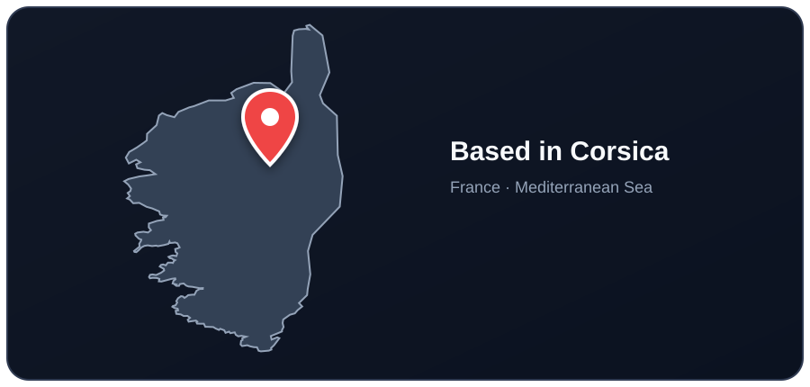
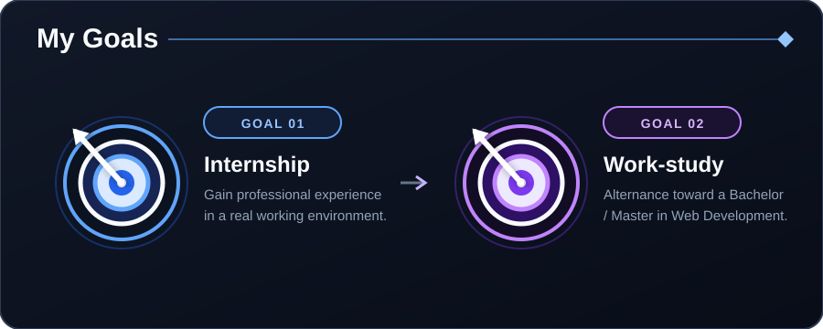
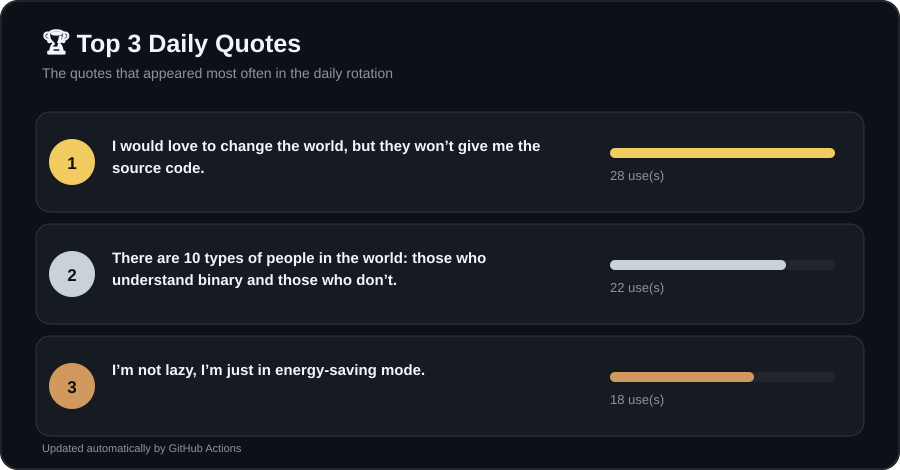

<!-- Corsica location card -->

  
I'm passionate about **creating things** — web applications, games, useful tools, and  experimental projects.  
I enjoy building, understanding systems, and improving them step by step.

 ---

📝 **Daily thought**
> I don't always write bugs, but when I do, they're in production.

---
  
## 🎯 Current Goal
 

 

> I’m also open to a **full-time position** if no alternance opportunity is available.

---

## 🧠 Profile

          const developer = {
            name: "Ange",
            role: "Full Stack Web Developer",
        
            profile: {
                specialization: "Backend",
                frontend: "Currently improving",
                certification: "Web Developer (Fullstack)"
            },
        
            interests: [
                "Web development",
                "Game development & modding",
                "Creative tools",
                "Useful applications",
                "AI-powered projects"
            ]
          ;
---

## ⭐ Featured Project

- **Time Management Web Application**  
  My main project, focused on backend logic, database design, and user management.  
  The project is actively evolving and serves as my primary technical showcase.

---

## 📖 Currently Learning & improving

<table align="center">
  <tr>
    <td align="center"> symfony</td>
    <td align="center"> react</td>
    <td align="center"> rust</td>
    <td align="center"> tauri</td>
    <td align="center"> arduino</td>
  </tr>
</table>
---

## 🧰 Languages, Frameworks & Tools

***Skills :***

<table align="center">
  
Frontend:
 
  <tr>
    <td align="center"> html</td>
    <td align="center"> css</td>
    <td align="center"> js</td>
    <td align="center"> ts</td>
  </tr>
</table>

<table align="center">
  
Backend:
 
  <tr>
    <td align="center"> java</td>
    <td align="center"> python</td>
    <td align="center"> php</td>
    <td align="center"> mysql</td>
    <td align="center"> githubactions</td>
  </tr>
</table>

<table align="center">
 
framework/librairie:
 
  <tr>
    <td align="center"> tailwind</td>
    <td align="center"> bootstrap</td>
    <td align="center"> react</td>
    <td align="center"> symfony</td>
  </tr>
</table>

<table align="center">
  
Tools:
 
  <tr>
    <td align="center"> figma</td>
    <td align="center"> git</td>
    <td align="center"> github</td>
  </tr>
</table>

---

## 📊 GitHub Stats

  

---

## 📫 Contact

- 📧 Email: ange.biancamaria09@gmail.com  
- 💼 LinkedIn: https://www.linkedin.com/in/ange-biancamaria/

---

> *Creating, learning, and building things that matter.*

<!-- TOP_QUOTES_START -->
### 🏆 Top 3 Daily Quotes

<!-- TOP_QUOTES_END -->
